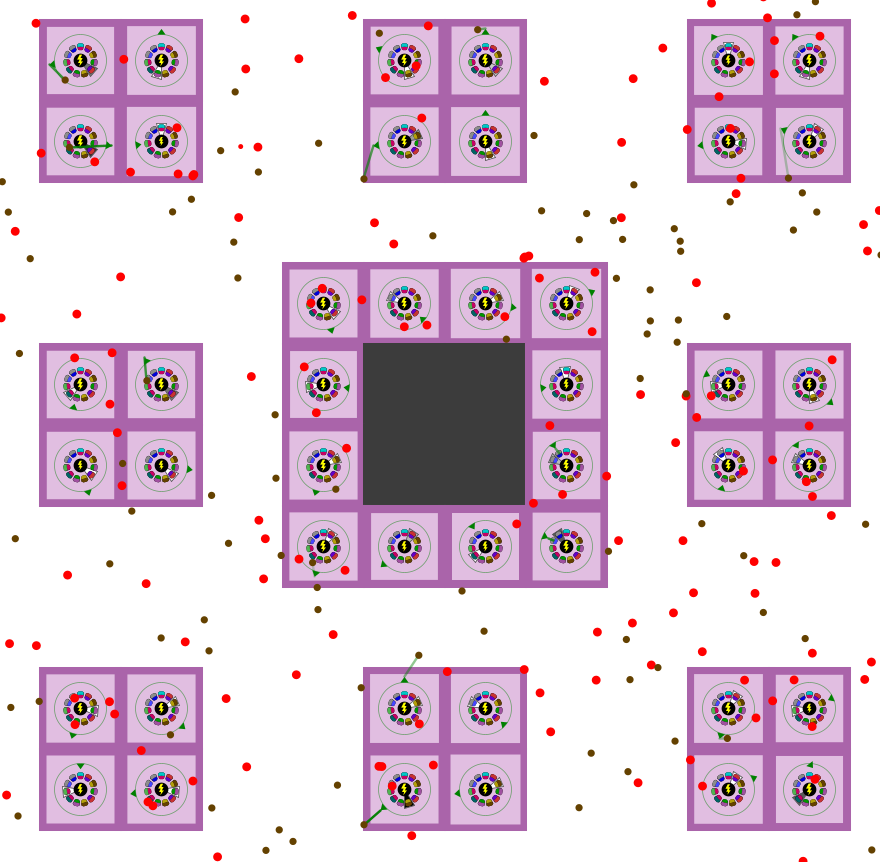

# VirusGameHQ

Remix of: https://github.com/carykh/VirusGame  
(This project fall under the same licence as the original project)

You can download releases [here](https://github.com/Fox2Code/VirusGameHQ/releases)

## Changes

- Smoother graphics / scroll

- Optimisations + multi-threading

- Food is bigger than waste to be colorblind friendly

- Project converted to a java project

- Camera can move with arrow keys

- Standalone jar (Shrunk with ProGuard for smaller file size)  
  (No need to download processing)

- Configurable speed (x0, x1, x2, x4)

## Graphics Comparison

### Before

### After

